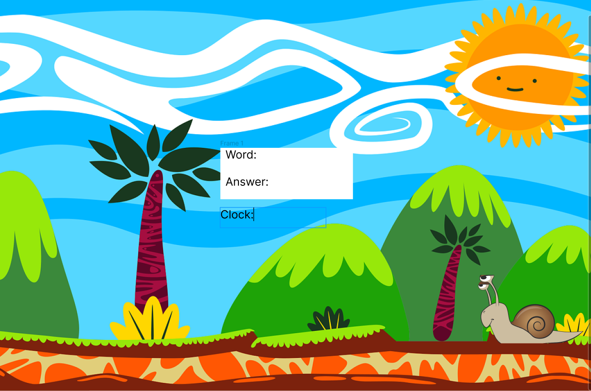

# MVP
Unscramble the words to move the snail forward. Failure to unscramble the word within the allotted amount of tries will bring the snail to the previous position.  Once the snail reaches the end let the player know they've won the game.

# PMVP
- multiple levels 
- categorize level by topic
- different background as player progress through the levels
- more animated graphics

# Wireframes

# Play instructions
Word Snail is a word scramble game.    You have 3 tries to guess the scrambled word. Each word unscrambled helps the snail move forward. 
Time is ticking! Failure to unscramble the word will bring him back to a 'snail's pace'.

# License -->
MIT License

Copyright (c) 2023 Marie Epps

Permission is hereby granted, free of charge, to any person obtaining a copy
of this software and associated documentation files (the "Software"), to deal
in the Software without restriction, including without limitation the rights
to use, copy, modify, merge, publish, distribute, sublicense, and/or sell
copies of the Software, and to permit persons to whom the Software is
furnished to do so, subject to the following conditions:

The above copyright notice and this permission notice shall be included in all
copies or substantial portions of the Software.

THE SOFTWARE IS PROVIDED "AS IS", WITHOUT WARRANTY OF ANY KIND, EXPRESS OR
IMPLIED, INCLUDING BUT NOT LIMITED TO THE WARRANTIES OF MERCHANTABILITY,
FITNESS FOR A PARTICULAR PURPOSE AND NONINFRINGEMENT. IN NO EVENT SHALL THE
AUTHORS OR COPYRIGHT HOLDERS BE LIABLE FOR ANY CLAIM, DAMAGES OR OTHER
LIABILITY, WHETHER IN AN ACTION OF CONTRACT, TORT OR OTHERWISE, ARISING FROM,
OUT OF OR IN CONNECTION WITH THE SOFTWARE OR THE USE OR OTHER DEALINGS IN THE
SOFTWARE.
